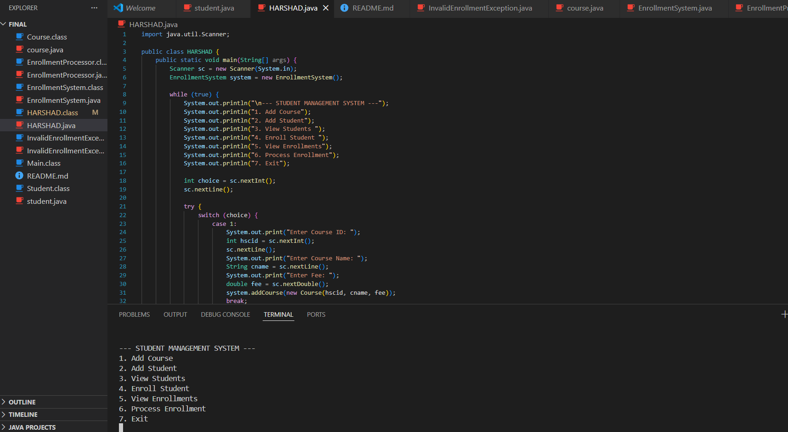

# Student Enrollment System

A simple Java console application for beginning learners. This project demonstrates how to manage students, courses, and enrollments using basic Java classes and a menu-driven interface.

## What this project does

- Lets you add new courses with an ID, name, and fee
- Lets you add new students with an ID, name, and email
- Shows all students currently in the system
- Enrolls a student in a course by ID
- Displays which courses each student is enrolled in
- Simulates enrollment processing with a small task runner

## How it works

- `HARSHAD.java` is the main program and starts the menu
- `EnrollmentSystem.java` stores students, courses, and enrollments
- `student.java` defines a student with ID, name, and email
- `course.java` defines a course with ID, name, and fee
- `EnrollmentProcessor.java` simulates processing an enrollment task
- `InvalidEnrollmentException.java` handles errors when a student or course is missing

## Run the project

From the project folder, compile and run the program:

```bash
javac HARSHAD.java
java HARSHAD
```

Then choose a menu option:

1. Add Course
2. Add Student
3. View Students
4. Enroll Student
5. View Enrollments
6. Process Enrollment
7. Exit


## Why this is useful

This project is a nice introduction to:

- Java classes and objects
- Collections like `HashMap` and `ArrayList`
- Exception handling
- Basic command-line interaction
- Simple program structure and flow
